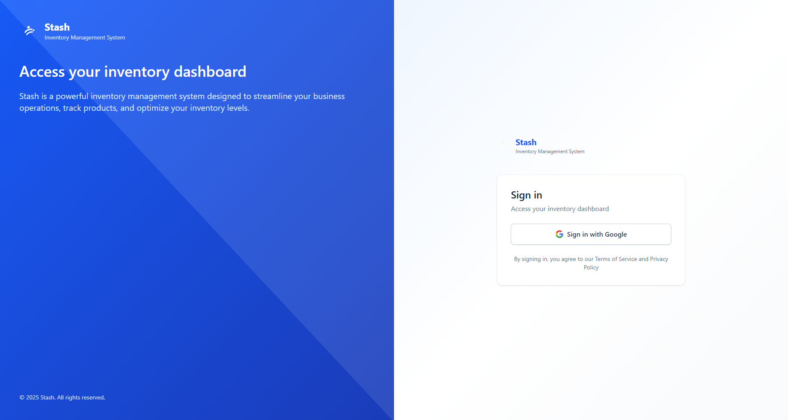
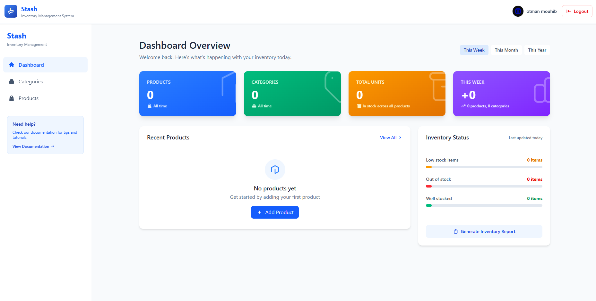
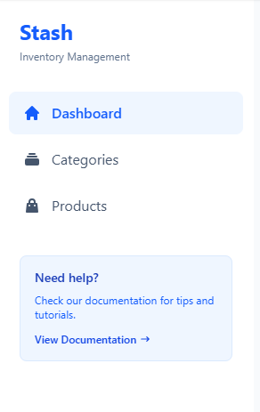
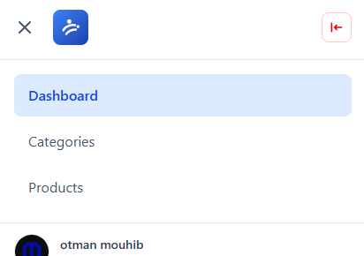

# Stash - User Guide

Welcome to **Stash**, your personal inventory management solution. This guide will help you get started and make the most of all the features available to you.

---

## Table of Contents

1. [Getting Started](#getting-started)
2. [Dashboard Overview](#dashboard-overview)
3. [Managing Categories](#managing-categories)
4. [Managing Products](#managing-products)
5. [Tips & Best Practices](#tips--best-practices)
6. [FAQ](#faq)

---

## Getting Started

### Signing In

Stash uses Google authentication for a secure and seamless sign-in experience. No need to remember another password!

1. Visit the Stash login page
2. Click the **"Sign in with Google"** button
3. Select your Google account
4. You'll be redirected to your dashboard

<!-- SCREENSHOT: Login page - full screen -->

---

## Dashboard Overview

Once signed in, you'll land on your personal dashboard. This is your command center for managing your inventory.

<!-- SCREENSHOT: Dashboard overview - full screen -->

### Dashboard Stats

Your dashboard displays key metrics at a glance:

- **Total Products** - The total number of items in your inventory
- **Total Categories** - How many categories you've created
- **Low Stock Items** - Products that need restocking
- **Total Value** - The combined value of your inventory

### Navigation

Use the sidebar (desktop) or hamburger menu (mobile) to navigate between:

- **Dashboard** - Overview and statistics
- **Categories** - Organize your products
- **Products** - Manage individual items

<!-- SCREENSHOT: Navigation sidebar on desktop -->

<!-- SCREENSHOT: Mobile navigation menu -->

---

## Managing Categories

Categories help you organize your products into logical groups. We recommend creating categories before adding products.

### Creating a Category

1. Navigate to **Categories** from the sidebar
2. Click the **"Add Category"** button
3. Fill in the category details:
   - **Name** (required) - Give your category a descriptive name
   - **Description** (optional) - Add details about what belongs in this category
   - **Color** - Choose a color to visually distinguish this category
4. Click **"Save Category"**

<!-- SCREENSHOT: Add category modal - full screen -->

### Editing a Category

1. Find the category you want to edit
2. Click the **pencil icon** on the category card
3. Make your changes
4. Click **"Update Category"**

### Deleting a Category

1. Find the category you want to delete
2. Click the **trash icon** on the category card
3. Confirm the deletion in the popup

> **Note:** Deleting a category will not delete the products in it. Those products will become "Uncategorized".

### Bulk Delete Categories

1. Use the checkbox on each category card to select multiple categories
2. Or click **"Select all"** to select all visible categories
3. Click the **"Delete"** button that appears
4. Confirm the bulk deletion

<!-- SCREENSHOT: Categories page with selection - full screen -->

---

## Managing Products

Products are the individual items in your inventory. Each product can have details like name, description, price, stock quantity, and an image.

### Before Adding Products

> **Important:** You must create at least one category before you can add products. This ensures your inventory stays organized from the start.

### Adding a Product

1. Navigate to **Products** from the sidebar
2. Click the **"Add Product"** button
3. Fill in the product details:
   - **Name** (required) - The product name
   - **Description** (optional) - Details about the product
   - **Category** (required) - Select a category
   - **Units** - How many units you have in stock
   - **Price** - The price per unit
   - **Image** - Upload a product image (click or drag & drop)
4. Click **"Save Product"**

<!-- SCREENSHOT: Add product form - full screen -->

### Product Cards

Each product is displayed as a card showing:

- Product image (or placeholder if none)
- Product name
- Stock quantity
- Category status
- Price tag
- Quick action buttons

<!-- SCREENSHOT: Product card close-up -->

### Viewing Product Details

1. Click the **eye icon** on any product card
2. A detailed view opens showing:
   - Full-size image gallery (navigate with arrows if multiple images)
   - Complete product information
   - Stock status
   - Quick edit button

<!-- SCREENSHOT: Product details modal - full screen -->

### Editing a Product

1. Click the **pencil icon** on the product card, OR
2. Open the product details and click **"Edit Product"**
3. Make your changes
4. Click **"Update Product"**

### Deleting a Product

1. Click the **trash icon** on the product card
2. Confirm the deletion in the popup

### Bulk Delete Products

1. Use the checkbox on each product card to select multiple products
2. Or click **"Select all"** to select all visible products
3. Click the **"Delete"** button that appears
4. Confirm the bulk deletion

<!-- SCREENSHOT: Products page with bulk selection - full screen -->

### Filtering Products

Use the filter options to find products quickly:

- **Search** - Type to search by product name
- **Category filter** - Filter by specific category

<!-- SCREENSHOT: Products filter options -->

---

## Tips & Best Practices

### Organizing Your Inventory

1. **Create categories first** - Plan your category structure before adding products
2. **Use descriptive names** - Make it easy to find items later
3. **Add images** - Visual identification helps manage inventory faster
4. **Keep stock updated** - Regularly update quantities to maintain accuracy

### Using on Mobile

Stash is fully responsive and works great on mobile devices:

- Use the **hamburger menu** (☰) to access navigation
- All features are available on mobile
- Swipe-friendly product and category cards

<!-- SCREENSHOT: Mobile dashboard view - full screen -->

<!-- SCREENSHOT: Mobile products view - full screen -->

### Low Stock Alerts

Keep an eye on the **Low Stock Items** stat on your dashboard. Products with zero units are marked as "OUT OF STOCK" with a red banner.

---

## FAQ

### How do I sign out?

Click the **"Logout"** button in the top-right corner of the header (or in the mobile menu).

### Can I recover deleted products or categories?

No, deletions are permanent. Please confirm carefully before deleting.

### Why can't I add a product?

You need at least one category before adding products. Go to **Categories** and create one first.

### Is my data secure?

Yes! Stash uses Google authentication and your data is stored securely. Each user has their own private inventory that only they can access.

### Can I access Stash on multiple devices?

Yes! Sign in with the same Google account on any device to access your inventory.

---

## Need More Help?

If you have questions not covered in this guide, please reach out to our support team.

---

*© 2025 Stash. All rights reserved.*
